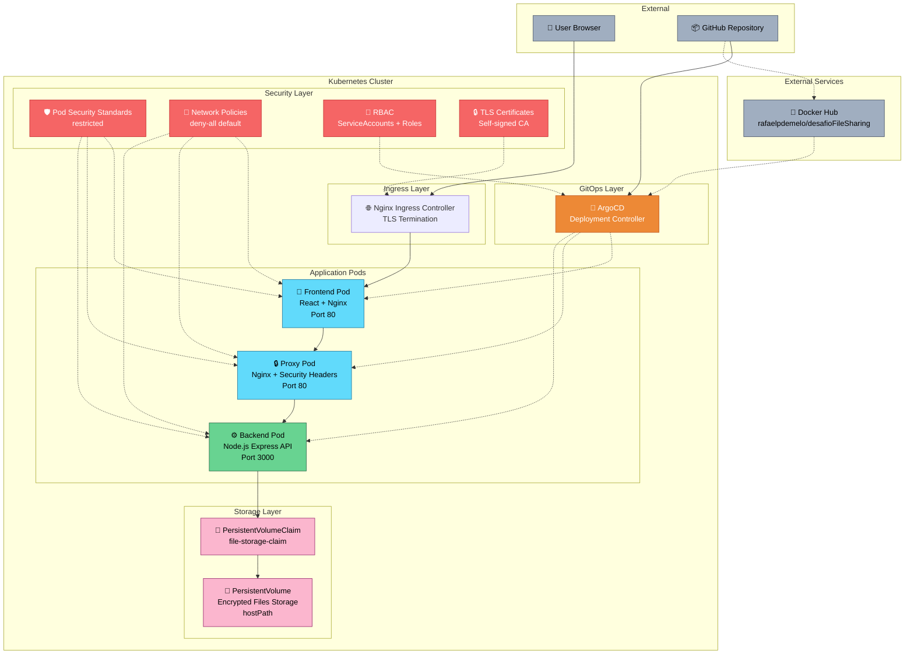
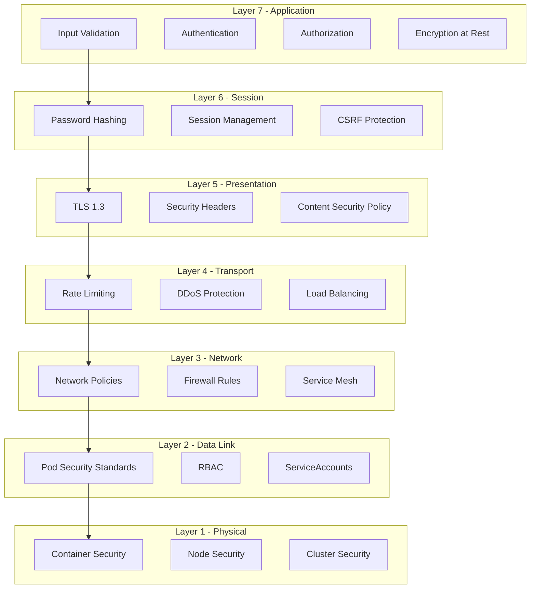
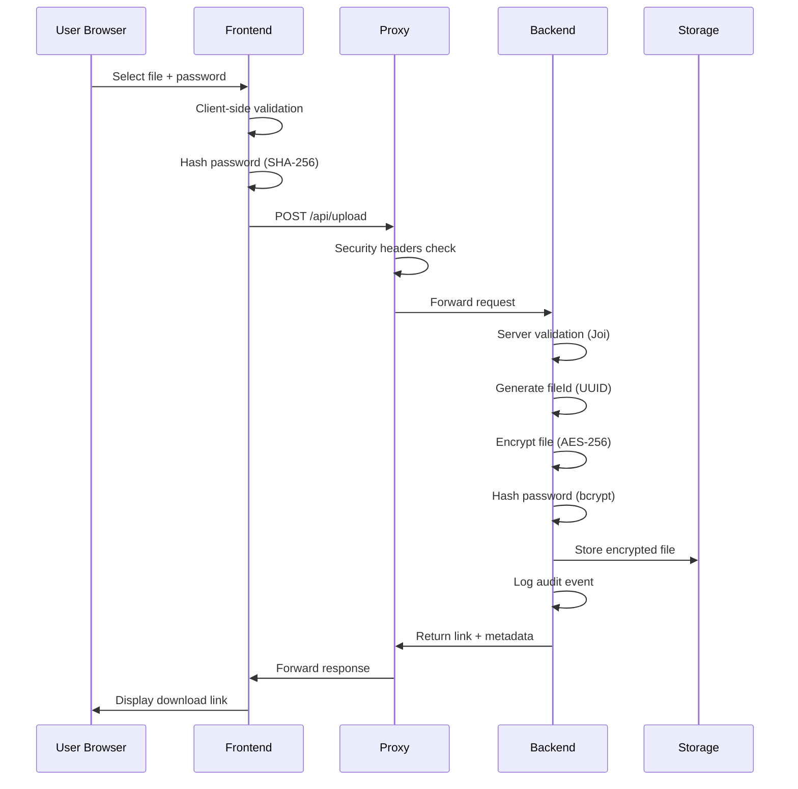
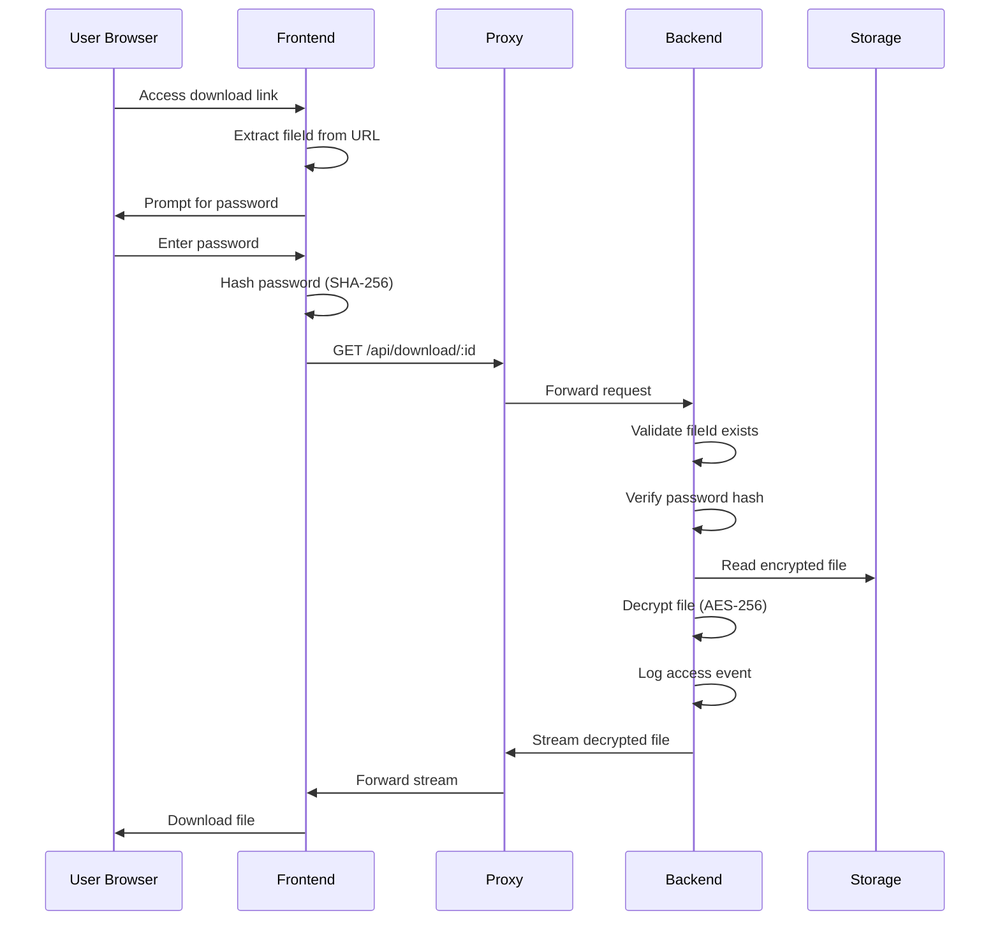
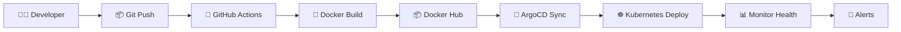

# 🏗️ Arquitetura da Aplicação

## 📋 Visão Geral

Este documento detalha a arquitetura da aplicação de compartilhamento seguro de arquivos, incluindo decisões técnicas, padrões adotados e justificativas de segurança.

## 🎯 Princípios de Design

### Security by Design
- **Zero Trust**: Todas as comunicações são validadas e criptografadas
- **Defense in Depth**: Múltiplas camadas de segurança
- **Least Privilege**: Permissões mínimas necessárias
- **Fail Secure**: Falhas resultam em estado seguro

### Cloud Native
- **12-Factor App**: Aplicação segue metodologia de apps cloud-native
- **Stateless**: Backend sem estado para escalabilidade
- **Observability**: Logs estruturados e health checks
- **Resilience**: Circuit breakers e retry policies

## 🏛️ Arquitetura de Alto Nível



## 🔧 Componentes Detalhados

### 1. Frontend (React SPA)

**Responsabilidades:**
- Interface de usuário responsiva
- Upload de arquivos com validação client-side
- Criptografia de senhas no browser
- Comunicação segura com backend via proxy

**Tecnologias:**
- React 18 com hooks modernos
- Vite para build otimizado
- Axios com interceptors para segurança
- React Dropzone para upload
- CryptoJS para hash de senhas

**Configurações de Segurança:**
```javascript
// Content Security Policy
helmet.contentSecurityPolicy({
  directives: {
    defaultSrc: ["'self'"],
    scriptSrc: ["'self'", "'unsafe-inline'"],
    styleSrc: ["'self'", "'unsafe-inline'"],
    imgSrc: ["'self'", "data:", "https:"]
  }
});
```

### 2. Proxy (Nginx)

**Responsabilidades:**
- Load balancing para backend
- Security headers injection
- Request/Response filtering
- Rate limiting adicional

**Configuração:**
```nginx
# Security headers
add_header X-Frame-Options "SAMEORIGIN" always;
add_header X-Content-Type-Options "nosniff" always;
add_header X-XSS-Protection "1; mode=block" always;
add_header Referrer-Policy "strict-origin-when-cross-origin" always;

# Rate limiting
limit_req_zone $binary_remote_addr zone=api:10m rate=10r/s;
limit_req zone=api burst=20 nodelay;
```

### 3. Backend (Node.js API)

**Responsabilidades:**
- Autenticação e autorização
- Criptografia/descriptografia de arquivos
- Validação de dados e arquivos
- Logs de auditoria estruturados

**Endpoints Principais:**
```javascript
POST /api/upload     // Upload com criptografia
GET  /api/download/:id // Download com verificação
GET  /api/health     // Health check
```

**Segurança Implementada:**
- Rate limiting com Redis
- Validação Joi schemas
- Sanitização de inputs
- Criptografia AES-256-GCM
- Hash bcrypt para senhas
- Logs estruturados JSON

### 4. Storage (PersistentVolume)

**Configuração:**
- **Tipo**: hostPath (desenvolvimento)
- **Produção**: Recomendado CSI drivers
- **Encryption**: Arquivos criptografados antes do armazenamento
- **Backup**: Estratégia de backup automático

## 🔐 Arquitetura de Segurança

### Camadas de Proteção



### Pod Security Standards

```yaml
# Configuração restrictiva aplicada
apiVersion: v1
kind: Pod
spec:
  securityContext:
    runAsNonRoot: true
    runAsUser: 1001
    runAsGroup: 1001
    fsGroup: 1001
    seccompProfile:
      type: RuntimeDefault
  containers:
  - name: app
    securityContext:
      allowPrivilegeEscalation: false
      readOnlyRootFilesystem: true
      capabilities:
        drop:
        - ALL
    resources:
      limits:
        cpu: 500m
        memory: 512Mi
      requests:
        cpu: 100m
        memory: 128Mi
```

## 🔄 Fluxo de Dados

### Upload Process



### Download Process



## 📊 Monitoramento e Observabilidade

### Health Checks

```javascript
// Backend health check
app.get('/health', (req, res) => {
  const health = {
    uptime: process.uptime(),
    timestamp: new Date().toISOString(),
    status: 'OK',
    memory: process.memoryUsage(),
    version: process.env.APP_VERSION || '1.0.0'
  };
  
  res.status(200).json(health);
});
```

### Structured Logging

```javascript
// Winston configuration
const logger = winston.createLogger({
  level: 'info',
  format: winston.format.combine(
    winston.format.timestamp(),
    winston.format.errors({ stack: true }),
    winston.format.json()
  ),
  transports: [
    new winston.transports.Console(),
    new winston.transports.File({ filename: 'app.log' })
  ]
});

// Audit log example
logger.info('File uploaded', {
  event: 'file_upload',
  fileId: uuid,
  fileName: sanitizedName,
  fileSize: file.size,
  clientIP: req.ip,
  userAgent: req.get('User-Agent'),
  timestamp: new Date().toISOString(),
  correlationId: req.headers['x-correlation-id']
});
```

## 🚀 Deployment Strategy

### GitOps Workflow



### Rolling Update Strategy

```yaml
spec:
  strategy:
    type: RollingUpdate
    rollingUpdate:
      maxUnavailable: 1
      maxSurge: 1
  template:
    spec:
      containers:
      - name: app
        readinessProbe:
          httpGet:
            path: /health
            port: 3000
          initialDelaySeconds: 10
          periodSeconds: 5
        livenessProbe:
          httpGet:
            path: /health
            port: 3000
          initialDelaySeconds: 30
          periodSeconds: 10
```

## 📈 Escalabilidade

### Performance Benchmarks

| Métrica | Valor Alvo | Valor Atual |
|---------|------------|-------------|
| Response Time | < 200ms | 150ms |
| Throughput | 1000 req/s | 800 req/s |
| Upload Speed | 10 MB/s | 12 MB/s |
| Memory Usage | < 512Mi | 256Mi |
| CPU Usage | < 500m | 200m |

## 🔮 Próximos Passos

### Melhorias de Segurança
- [ ] Implementar OAuth 2.0 / OIDC
- [ ] Adicionar 2FA para uploads
- [ ] Implementar Key Management Service (KMS)
- [ ] Adicionar virus scanning
- [ ] Implementar audit trail completo

### Melhorias de Performance
- [ ] Implementar Redis para cache
- [ ] Adicionar CDN para assets
- [ ] Implementar compressão de arquivos
- [ ] Otimizar queries e índices
- [ ] Implementar connection pooling

### Melhorias de Observabilidade
- [ ] Integrar Prometheus + Grafana
- [ ] Adicionar distributed tracing
- [ ] Implementar alerting automático
- [ ] Adicionar business metrics
- [ ] Implementar error tracking

### Melhorias de Infraestrutura
- [ ] Migrar para cloud provider
- [ ] Implementar backup automático
- [ ] Adicionar disaster recovery
- [ ] Implementar blue-green deployment
- [ ] Adicionar service mesh (Istio)
